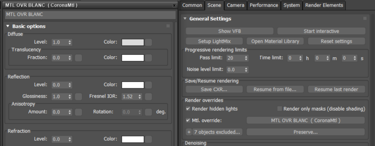
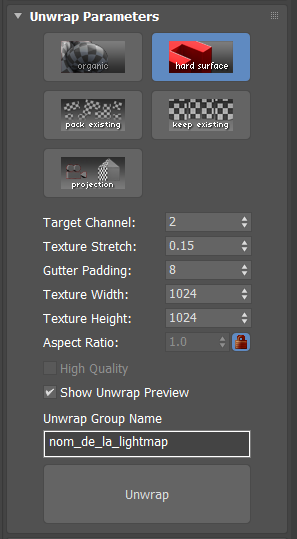
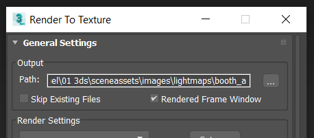
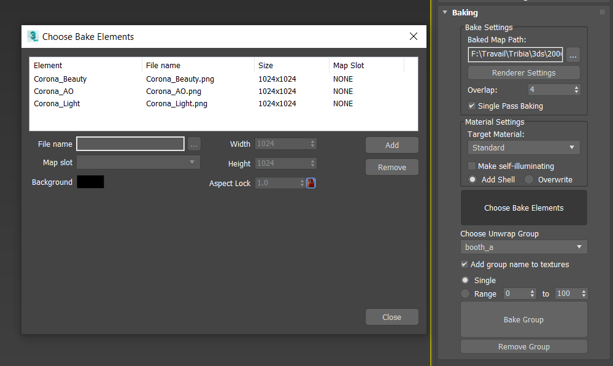

# Baking Lightmaps & AOmaps

On va utiliser Flatiron pour déplier les UV2 et baker les maps.

### Etapes :
- Préparation des objets
- Dépliage UV2
- Choix des passes et baking
- Baking
- Retouche
- Utilisation au sein du projet

## Préparation des objets
Comme Corona ne propose pas de passe lightmap de base, il va falloir tricher un peu. On va appliquer un `Material Override` (`Render Settings (F10) => Scene => Render Overrides`) avec un **matériau mat presque blanc** (220 dans mon cas pour que ça ne crame pas trop).



Si il y a des objets **lumineux** ou **transparents**, il faut les **exclure de l'override** pour garder leur impact sur la lightmap, éclairage si lumineux et ombres atténuées si transparent. Pour ça il faut sélectionner les objets à exclure et cliquer sur le `+` pour les ajouter à la liste.

**Régler l'éclairage de la scène** à l'aide du rendu interactif de Corona. S'assurer qu'il n'y a pas d'ombres trop marquées qui dépassent du sol du Stand, autrement ça va faire bizarre puisque ces ombres ne seront pas visibles sur le sol de la Zone qui possèdera une lightmap différente.

Pour les objets `produits`, on ne va pas les inclure du tout dans la lightmap, **voir ci-dessous**.

Par défaut les objets sont dépliés proportionnellement à leur dimensions dans la scène. Il est possible de réduire (ou augmenter) l'échelle d'un objet particulier, afin qu'il occupe plus ou moins d'espace UV. Par exemple, un sol très grand va prendre beaucoup de place et les objets plus petits n'occuperont que quelques pixels. Pour modifier l'échelle prise en compte par Flatiron, il faut rajouter la ligne suivante dans les propriétés de l'objet :
```
FlatironScale=0.5
```

Pour plus d'infos, voir [http://doc.texturebaking.com/Scaling.html](http://doc.texturebaking.com/Scaling.html)

## Dépliage UV2
Pour accéder à l'interface de Flatiron, aller dans l'onglet `Utilities`. S'il n'apparaît pas, cliquer sur `More` et le chercher dans la liste.

Sélectionner les objets à inclure dans la lightmap (on ne sélectionnera pas les `produits`).

Paramètres à utiliser pour le dépliage :
- Type de dépliage : `hard surface`
- `Target Channel` (canal UV) : 2
- `Gutter Padding` (espace entre les ilots) : 8
- `Texture Width & Height` : pas très important on règlera ça au moment du choix des maps à baker
- `Unwrap Group Name` : nom qui sera utilisé plus tard pour choisir quel groupe baker. Sera utilisé automatiquement pour les noms de fichiers générés (ex. `booth_a_Corona_Beauty.png`)




Une fois cliqué sur `Unwrap`, un aperçu du dépliage sera affiché si `Show Unwrap Preview` est coché.

## Choix des passes et baking
### Réglages dans le rollout `Baking` :
- `Baked Map Path` : **ça ne fonctionne pas !** Il faut régler le chemin d'enregistrement des maps dans la fenêtre `Render To Texture (touche 0)` de Max...
- `Overlap` : 4 (la moitié de `Gutter Padding`)


Choix du chemin d'enregistrement des passes

### Choix des passes
On va utiliser les passes suivantes :
- `Corona_Beauty` : la lightmap
- `Corona_AO` : passe d'AO, régler `Background` en blanc et laisser la distance à 50

~~Pour chacune d'elles, cocher si possible `Apply denoising also to this render element`. *Il y a un bug d'interface qui fait qu'il peut-être masqué, passer la souris par dessus pour le faire apparaître.*~~ Pour l'instant ne pas appliquer de denoising, ça ajoute des artefacts, et le viewer gère tout seul pour diminuer le bruit des maps.

Les noms de fichiers indiqués sont affichés sans le nom du groupe réglé dans `Unwrap Group Name`, mais il sera bien ajouté au moment de l'enregistrement, pas besoin de toucher aux noms normalement. Par exemple si dans la colonne `File Name` il est indiqué `Corona_AO.png`, le fichier enregistré aura bien le nom `booth_a_Corona_AO.png`.

C'est ici également qu'on va régler la **résolution des maps**.



### Baking
Si il y a plusieurs groupes d'objets qui ont été dépliés, il faudra choisir lequel on veut baker avec le dropdown `Choose Unwrap Group`.

Une fois les réglages effectués il n'y a plus qu'a cliquer sur `Bake Group`.

**Attention, si les fichiers existent déjà, ils seront écrasés (à la fin du rendu) sans avertissement !** Il est possible d'annuler le rendu sans enregistrer (avant la fin bien sûr) en cliquant sur `Cancel` (et pas `Stop`) dans la fenêtre de rendu.

## Retouche
Il va falloir retoucher un peu les lightmaps et aomaps avant de pouvoir les utiliser. En effet l'aomap ne prend pas en compte l'éclairage ni la transparence, donc des zones éclairées seront quand même affectées par l'AO. Il faut "peindre" les zones sensées être éclairées pour supprimer l'effet de l'AO...

Pour booster un peu la lightmap, on peut régler les niveau pour augmenter le contraste et faire plus ressortir les zones claires et sombres. Attention aux artefacts invisibles avec un faible contraste, qui vont ressortir beaucoup plus.

Les fichiers `png` sont généralement enregistrés en 16 bits avec alpha (à moins de régler en RGB 24 bits avec alpha décoché), leur poids est donc conséquent. Pour le réduire, il faut dans Photoshop les convertir en 8 bits (de ~4 Mo on passe à ~1 Mo). On peut aussi les convertir en `jpeg` (de préférence en qualité max pour limiter les artefacts) pour réduire encore un peu plus le poids.

## Utilisation au sein du projet
Se reporter ici : [Préparation Zone / Lightmaps & Envmaps](preparation-zone.md#lightmaps--envmaps)