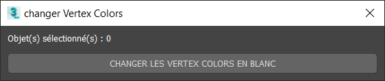

# Outils Maxscript
Pour faciliter le réglage des propriétés des objets, il y a des petits scripts qui permettent de définir les paramètres sans trop se préoccuper de la forme du code requis.

## Propriétés des objets (v0.4.12)

[Outil téléchargeable ICI](maxscripts/TRIBIA_CongressUserProperties.ms) (dernière mise à jour 0.4.12 le 17/10/2020)


- **type** :
    - `booth` : défini cet objet comme un Stand. Il faudra également remplir `id` pour spécifier de quel stand il s'agit (et éventuellement `booth_model` si on veut instancier un modèle de stand sur le dummy).
    - `booth_camera` : défini cette caméra comme caméra de stand. **Nécessaire pour pouvoir entrer sur le stand !**
    - `booth_model` : défini cet objet comme modèle de stand. Il faudra spécifier un nom dans `boothModel` plus bas.
    - `camera` : défini cette caméra comme caméra de zone. **Nécessaire pour le bon chargement de la zone !**
    - `camera_position` : défini cette caméra comme cible pour un déplacement direct dans la zone. Il faudra également remplir `id` pour spécifier de quel caméra il s'agit
    - `goto_position` : défini cet objet comme cliquable pour se déplacer vers la caméra définie dans `id`
    - `goto_zone` : défini cet objet comme cliquable pour charger la zone définie dans `id`
    - `ground` : défini cet objet comme sol cliquable pour les déplacement dans la zone. **Nécessaire si on veut pouvoir se déplacer dans la zone**
    - `lab` : défini cet objet comme étant un lab
    - `lightmap` : nom de la lightmap contenue dans le matériau de cet objet. L'objet ne sera pas affiché et la lightmap sera copiée sur les matériaux des objets possédant la propriété `useLightmap` avec la même nom
    - `envmap` : idem que `lightmap` mais pour les map de réflexion. Utiliser `useEnvmap` sur les objets pour appliquer la map sur son matériau.
    - `product` : défini l'objet comme un produit, il faudra spécifier `media_type` et `key_3d`
- **booth & goto_zone & goto_position & lab**
    - `id` : uuid du stand (ex `5efb49ef2bac05001bf10e54`) ou uuid de la zone à charger (ex `6795ec46-b54b-46fb-9059-003a5cadca5b` pour l'accueil), ou id caméra (`camera_position`), ou uuid lab
    - `boothModel` : si `type=booth_model` alors on défini le nom de ce modèle. Si `type=booth` on va copier le modèle à la position/rotation de cet objet.
- **product**
    - `media_id` : défini le type de produit à afficher (texture, pdf, video)
    - `key_3d` : clé générique pour le placement du média (`logo`, `totem`, `innovation_1_image_1`, `innovation_2_video_1`, etc.)
- **lightmap & envmap**
    - `lightmap` : nom de la lightmap du slot diffuse du matériau appliqué à cet objet. A utiliser si `type=lightmap` est spécifié.
    - `useLightmap` : nom de la lightmap à utiliser sur l'objet (peu importe le type). La lightmap sera appliquée au matériau de l'objet et tous les matériaux des "enfants" de cet objet (pas besoin de le spécifier sur chaque objet). **Si `none` est spécifié pour cette propriété alors aucune lightmap ne sera appliquée à cet objet.**
    - `envmap` :  idem `lightmap`   
    - `useEnvmap` :  idem `useLightmap`
- **instances**
    - `instanceSource` : défini cet objet comme un modèle d'instance qui sera éventuellement cloné sur d'autres objets possédant la propriété `replaceBy`
    - `replaceBy` : nom de l'instance par laquelle remplacer cet objet (depuis un objet `instanceSource` contenu dans ce fichier, ou depuis la biblio objets)
- **matériaux**
    - `material` : nom du matériau à appliquer sur cet objet. Si vide, l'objet gardera son matériau, sinon il sera remplacé.
- **divers**
    - `booth_tooltip` : ouvrira le tooltip du stand au clic sur celui-ci
    - `transparent` : défini cet objet comme transparent, **non utilisé pour l'instant**
    - `do_not_scale` : utilisé pour les produits, cet objet (et ses enfants) ne sera pas mis à l'échelle en fonction du format de la texture (utilisé pour le support du pdf de stand)
    - `booth_contact` : au clic sur cet objet, le layer `contact` de kinoba sera ouvert (utilisé sur le calendrier et l'ipad)

## Vertex Colors



Pour que les matériaux apparaissent bien dans le viewer, il est nécessaire que les `vertex colors` soient blanches. Ce script permet de faire le changement en blanc sur tous les objets sélectionnés.
**Ca ne fonctionne pas sur les objets autres que `Edit Poly` et `Edit Mesh`, il faudra convertir les objets `Box`, `Plane`, etc. (en poly de préférence).

[Outil téléchargeable ICI](maxscripts/TRIBIA_SetVertexColorsToWhite.ms)

## Récupération UUIDs depuis fichier max (v0.1)

Permet de récupérer les UUIDs déjà spécifiés pour les stands d'une zone. Le script va sortir toute la liste des UUIDs présents dans les propriétés de tous les objets de la scène max.


```warning
Comme le champ `uuid` est également utilisé pour indiquer l'id de la zone vers laquelle se diriger dans le cas d'un objet `type=goto_zone`. Penser à vérifier la validité des uuids (les stands ne possèdent pas de tiret `-`)
```

[Outil téléchargeable ICI](maxscripts/TRIBIA_GetBoothUUIDs.ms)

## Copie-Colle Transform objet

Permet de copier la `position`, `rotation` et `scale` d'un objet d'une scène / fenêtre max dans le presse papier. Puis de les appliquer sur un autre objet dans une scène / fenêtre max différente (ou dans la même scène).


[Outil téléchargeable ICI](maxscripts/TRIBIA_CopyPasteTransformSOLO.ms)
