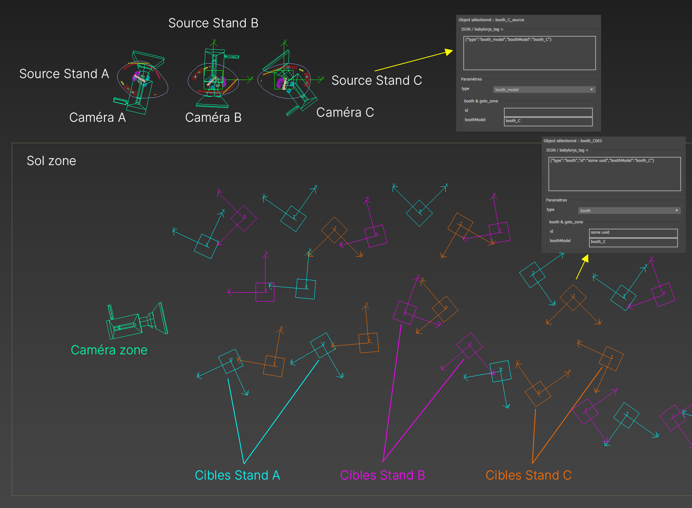
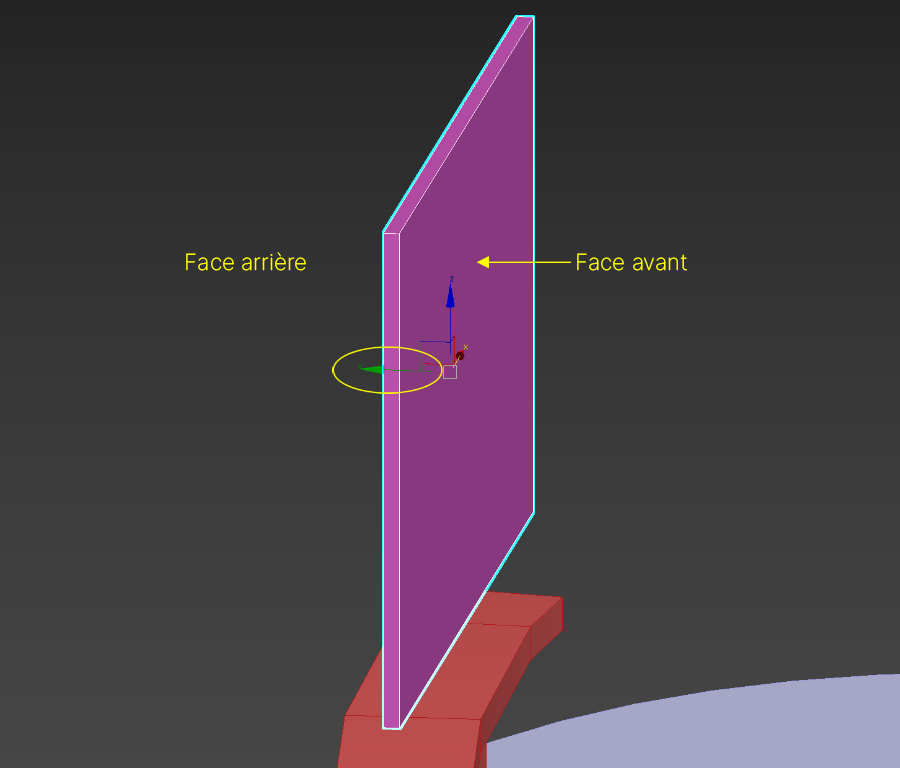
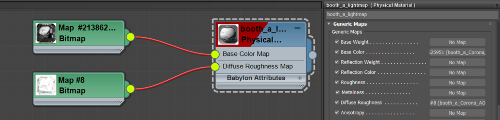
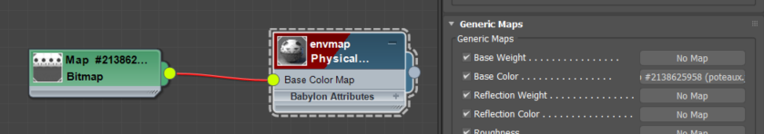

# Préparation Zone

## Outil Maxscript

Utiliser l'outil maxscript pour définir les propriétés, ou bien directement dans les `User Properties` de l'objet (clic droit => `Object Properties...` => `User Defined` => `babylonjs_tag={...}`)

[Téléchargement et indications pour utiliser l'outil.](outils-maxscript.md)

## Objets propres à la Zone

Tous les objets qui n'appartiennent pas à un Stand ou une Conférence, comme le sol des allées cliquable, et toutes les structures de l'espace. Il n'y pas de préparation particulière, à part pour le **sol** et la **caméra** de la Zone.
- Sol : `{"type":"ground"}`
- Caméra : `{"type":"camera"}` **Sans caméra pour la zone le chargement va planter**

On retrouvera également les objets support pour les lightmaps et envmap dans la zone, non parentés. [Voir ICI](#lightmaps--envmaps).

## Stands

### 1. Instances



> Objets de base pour une zone : un ***sol*** (type `ground`), une ***caméra de zone*** (type `camera`), des ***modèles de stands*** en haut (type `booth_model` et `boothModel=nom_du_modèle`) avec des ***caméras de stand*** (type `booth_camera`), des ***Points*** placés à la position des stands à instancier (type `booth`, `id=uuid` et `boothModel=nom_du_modèle`).

#### Sources

Copier les différents modèle de stands dans un coin pour s'en servir comme source. On peut le parenter à un Dummy (ou Point), ou bien avoir un objet parent (comme dans le fichier implantation, dans lequel le sol du stand est le parent). Les propriétés du parent à régler sont :
```json
{"type":"booth_model","boothModel":"__source_name__"}
```
- `type = booth_model` Permet de savoir que cet objet est un modèle de Stand et qu'il faudra le copier sur des "cibles"
- `boothModel = __source_name__` Nom de ce modèle de Stand

#### Cibles

Les cibles (Dummy ou Point) doivent être positionnées et orientées à l'identique de l'implantation en respectant le point de pivot de la source (idéalement au centre en z = 0). Elles devront avoir les propriétés suivantes :
```json
{"type":"booth","id":"__uuid__","boothModel":"__source_name__"}
```
- `type = booth` Permet au viewer de savoir qu'il s'agit d'un Stand et qu'on peut interagir avec lui
- `id = __uuid__` Permet de savoir de quel Stand il s'agit (uuid stockés en base)
- `boothModel = __source_name__` Nom du modèle de Stand (source) à copier sur cette cible (sera "enfant" de cet objet)

### 2. Caméra
Pour pouvoir pénétrer sur un stand, celui-ci doit posséder une caméra dans sa hiérarchie possédant la propriété `"type":"booth_camera"`.

### 3.1 Produits (dans Zone)

**Leur pivot doit être au centre, avec l'axe Y pointant vers l'arrière** (Z vers le haut, X vers la droite). Pour cette raison il ne faudra PAS faire de ~~`Reset XForm`~~ sur les produits, ça va reset l'orientation du pivot. Autrement la caméra générée pour s'approcher du produit ne sera pas correctement alignée.



> Le pivot (en local) est orienté de telle façon que Y pointe vers l'arrière)

Leurs propriétés sont du type :
```json
{"type":"product", "id":"XXXXXXXXXXX"}
```
- `type = product` Permet au viewer de savoir qu'il s'agit d'un produit / innovation
- `id = XXXXXXXXX` Permet de retrouver les données du produit dans le JSON de config

Les données affichées sont spécifiée dans le JSON de config, il peut y avoir plusieurs médias, pdf, image, vidéo youtube, iframe, etc.

### 3.2 Produits (dans Stands)

Les produits / innovations se présenteront sous forme de Plane carré pour pouvoir gérer les formats portrait et paysages plus facilement (ça peut changer selon les problèmes techniques qui peuvent survenir). **Leur pivot doit être au centre, avec l'axe Y pointant vers l'arrière** (Z vers le haut, X vers la droite). Pour cette raison il ne faudra PAS faire de ~~`Reset XForm`~~ sur les produits, ça va reset l'orientation du pivot.


> Le pivot (en local) est orienté de telle façon que Y pointe vers l'arrière)

Leurs propriétés sont du type :
```json
{"type":"booth_product", "key_3d":"slider_3"}
```
- `type = product` Permet au viewer de savoir qu'il s'agit d'un produit / innovation
- `key_3d = slider_3` Clé générique qui permet au viewer de savoir quelle texture afficher (lien directement fourni par ~~la bdd~~ le JSON de config)

### 4. Tooltips
Avant de pénétrer sur les stands, on affichera un tooltip avec des informations. L'ouverture se fera lors du clic sur le totem et le logo du Stand. Pour pouvoir les repérer, il faut définir la propriété `booth_tooltip` à `true`. Cela fonctionne de manière récursive donc si un parent possède cette propriété, le clic sur un objet enfant déclenchera aussi l'ouverture du tooltip.

Paramétrer cette propriété à l'aide de l'outil maxscript, en cochant (ou non) la case en bas `booth_tooltip`.

## Lightmaps & Envmaps

### 1. Lightmaps

#### Création

Il peut y avoir plusieurs lightmaps dans une même zone, par exemple une lightmap par modèle de Stand, et une lightmap globale (ou plusieurs) pour le sol et les objets de la zone (poteaux, etc.). Afin de garder une résolution assez bonne, sans pour autant avoir des fichiers énormes. Pour baker les lightmaps facilement, il faut utiliser [flatiron](https://www.texturebaking.com/), qui va déplier les `UV2` automatiquement et baker tous les objets en meme temps.

Il n'y a pas de passe Lightmap à proprement parler dans Corona, mais il y a une astuce pour obtenir à peu près le même résultat :
- Appliquer un `Mtl. Override`sur la scène avec un matériau blanc (ou presque blanc) et mat
- Exclure les objets lumineux ou transparents de cet override
- Dans `Choose Bake Elements` choisir `Corona_Beauty` (et éventuellement `Corona_AO`)
- Il faudra peut-être arranger l'intensité des ombres en post => Mais le faire de manière homogène sur toutes les LM...

#### Objets supports

Il faut créer des objets "support" pour les différentes lightmaps, et leur appliquer un matériau avec un `Bitmap` contenant la **lightmap** sur le slot `Base Color Map` (diffuse) et l'**AOmap** sur le slot `Diffuse Roughness Map` (interprété comme AO par l'exporteur). Ces objets seront placés dans la zone (ou bien dans bibliothèque de matériaux), peu importe où, ils ne seront pas affichés.



Ces objets doivent avoir les propriétés suivantes :
```json
{"type":"lightmap","lightmap":"booth_a_lightmap"}
```
- `type = lightmap` Permet au viewer de savoir qu'il s'agit d'une lightmap
- `lightmap = __nom_lightmap__` Nom de la lightmap que cet objet contient

#### Application sur des objets

Pour utiliser telle ou telle lightmap sur un objet ou hiérarchie d'objets, il faut définir la propriété `useLightmap` avec le nom de la lightmap en question. Pas besoin de définir cette propriété sur chaque objets, si l'objet parent possède la propriété alors la lightmap sera appliquée à tous les enfants. Par exemple, dans le cas des Stands il faudra définir `"useLightmap":"nom_lightmap"` uniquement sur l'objet parent (dummy ou sol).

Dans l'exemple ci-dessous on peut voir que la lightmap `booth_a_lightmap` sera appliquée sur le modèle de Stand `booth_A` (et donc sur toutes les instances clonées par la suite et tous les objets enfants).
```json
{"type":"booth_model","boothModel":"booth_A","useLightmap":"booth_a_lightmap"}
```

Il est possible d'empêcher l'ajout d'une lightmap sur un objet enfant en spécifiant `"useLightmap":"none"`. Ca peut être utile pour le verre, des objets lumineux, ou des objets sur lesquels on ne veut pas d'ombre (produits ?).

### 2. Envmap / Map d'environnement

#### Création & objet support

Pour l'instant **une seule map d'environnement est possible par zone**. Le fonctionnement est quasi similaire à celui des lightmaps, un objet support placé dans la bibliothèque de matériaux (ou directement dans la zone), sur lequel on applique un matériau avec l'envmap sur le slot `Base Color Map`. La map doit être **équirectangulaire**, et au format `2:1`, une dimension en puissance de 2 est recommandée  (4096x2048, 2048x1024, etc.).



Les propriétés de l'objet support sont les suivantes :
```json
{"type":"envmap","envmap":"default"}
```
- `type = envmap` Permet au viewer de savoir qu'il s'agit d'une map d'environnement
- `envmap = default` Nom de la map d'environnement. **Pour l'instant seul le nom** `default` **est pris en compte**

#### Application sur des objets

Comme écrit juste au dessus, pour l'instant il ne peut y avoir qu'une seule map d'environnement par zone, si le besoin s'en fait ressentir il sera possible d'en spécifier plusieurs comme pour les lightmaps. Donc l'unique envmap est appliquée à TOUS les objets de la zone.

Le seul cas où l'envmap ne sera PAS appliquée à un objet, est si cet objet possède la propriété `"useEnvmap":"none"`. Alors aucune envmap ne lui sera appliqué. Ca peut être utile pour des objets lumineux.
