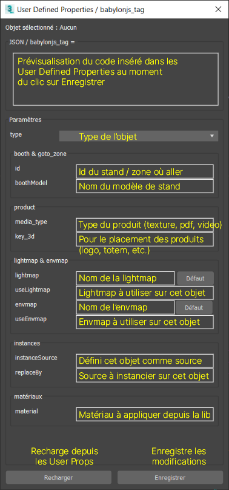

# Préparation Zone

## Outil Maxscript
Pour faciliter le réglage des propriétés des objets, il y a un petit script qui permet de définir les paramètres sans trop se préoccuper de la forme du code requis.

[Fichier téléchargeable ICI](maxscripts/TRIBIA_CongressUserProperties.ms)



- **type** :
    - `booth` : défini cet objet comme un Stand. Il faudra également remplir `id` pour spécifier de quel stand il s'agit (et éventuellement `booth_model` si on veut instancier un modèle de stand sur le dummy).
    - `booth_camera` : défini cette caméra comme caméra de stand. **Nécessaire pour pouvoir entrer sur le stand !**
    - `booth_model` : défini cet objet comme modèle de stand. Il faudra spécifier un nom dans `boothModel` plus bas.
    - `camera` : défini cet caméra comme caméra de zone. **Nécessaire pour le bon chargement de la zone !**
    - `goto_zone` : défini cet objet comme cliquable pour charger la zone définie dans `id`
    - `ground` : défini cet objet comme sol cliquable pour les déplacement dans la zone
    - `lightmap` : nom de la lightmap contenue dans le matériau de cet objet. L'objet ne sera pas affiché et la lightmap sera copiée sur les matériaux des objets possédant la propriété `useLightmap` avec la même nom
    - `envmap` : idem que `lightmap` mais pour les map de réflexion. Utiliser `useEnvmap` sur les objets pour appliquer la map sur son matériau.
    - `product` : défini l'objet comme un produit, il faudra spécifier `media_type` et `key_3d`
- **booth & goto_zone**
    - `id` : uuid du stand (ex `5efb49ef2bac05001bf10e54`) ou uuid de la zone à charger (ex `6795ec46-b54b-46fb-9059-003a5cadca5b` pour l'accueil)
    - `boothModel` : si `type=booth_model` alors on défini le nom de ce modèle. Si `type=booth` on va copier le modèle à la position/rotation de cet objet.
- **product**
    - `media_id` : défini le type de produit à afficher (texture, pdf, video)
    - `key_3d` : clé générique pour le placement du média (`logo`, `totem`, `innovation_1_image_1`, `innovation_2_video_1`, etc.)
- **lightmap & envmap**
    - `lightmap` : nom de la lightmap du slot diffuse du matériau appliqué à cet objet. A utiliser si `type=lightmap` est spécifié.
    - `useLightmap` : nom de la lightmap à utiliser sur l'objet (peu importe le type)
    - `envmap` :  idem `lightmap`
    - `useEnvmap` :  idem `useLightmap`
- **instances**
    - `instanceSource` : défini cet objet comme un modèle d'instance qui sera éventuellement cloné sur d'autres objets possédant la propriété `replaceBy`
    - `replaceBy` : nom de l'instance par laquelle remplacer cet objet (depuis un objet `instanceSource` contenu dans ce fichier, ou depuis la biblio objets)
- **matériaux**
    - `material` : nom du matériau à appliquer sur cet objet. Si vide, l'objet gardera son matériau, sinon il sera remplacé.

## Objets propres à la Zone
Tous les objets qui n'appartiennent pas à un Stand ou une Conférence, comme le sol des allées cliquable, et toutes les structures de l'espace. Il n'y pas de préparation particulière, à part pour le **sol** et la **caméra** de la Zone.
- Sol : `{"type":"ground"}`
- Caméra : `{"type":"camera"}` **Sans caméra pour la zone le chargement va planter**


## Stands
### 1. Instances


> Objets de base pour une zone : un ***sol*** (type `ground`), une ***caméra de zone*** (type `camera`), des ***modèles de stands*** en haut (type `booth_model` et `boothModel=nom_du_modèle`) avec des ***caméras de stand*** (type `booth_camera`), des ***Points*** placés à la position des stands à instancier (type `booth`, `id=uuid` et `boothModel=nom_du_modèle`).

#### Sources
Copier les différents modèle de stands dans un coin pour s'en servir comme source. On peut le parenter à un Dummy (ou Point), ou bien avoir un objet parent (comme dans le fichier implantation, dans lequel le sol du stand est le parent). Les propriétés du parent à régler sont :
```json
{"type":"booth_model","boothModel":"__source_name__"}
```
- `type = booth_model` Permet de savoir que cet objet est un modèle de Stand et qu'il faudra le copier sur des "cibles"
- `boothModel = __source_name__` Permet de savoir sur quelles "cibles" copier ce modèle

#### Cibles
Les cibles (Dummy ou Point) doivent être positionnées et orientées à l'identique de l'implantation en respectant le point de pivot de la source (idéalement au centre en z = 0). Elles devront avoir les propriétés suivantes :
```json
{"type":"booth","id":"__uuid__","boothModel":"__source_name__"}
```
- `type = booth` Permet au viewer de savoir qu'il s'agit d'un Stand et qu'on peut interagir avec lui
- `id = __uuid__` Permet de savoir de quel Stand il s'agit (uuid stockés en base)
- `boothModel = __source_name__` Permet de savoir quelle "source" copier sur cette cible

### 2. Produits
Les produits / innovations se présenteront sous forme de Plane carré pour pouvoir gérer les formats portrait et paysages plus facilement (ça peut changer selon les problèmes techniques qui peuvent survenir). Leur pivot doit être au centre, avec l'axe Y pointant vers l'arrière (Z vers le haut, X vers la droite). Leurs propriétés sont du type :
```json
{"type":"product","media_type":"texture","key_3d":"poster"}
```
- `type = product` Permet au viewer de savoir qu'il s'agit d'un produit / innovation
- `media_type = texture` Permet au viewer d'afficher la texture sur l'objet (il y a aussi `pdf` et `video`)
- `key_3d = poster` Clé générique qui permet au viewer de savoir quelle texture afficher (lien directement fourni par la bdd)

**Ne pas se focaliser là dessus pour l'instant, ça va changer avec les nouveaux `key_3d` introduits par Kinoba...**