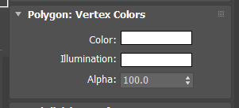

# Procédure de modélisation 3d

## Types de fichiers
Tout d'abord il y a les **fichiers bibliothèques**, pour les objets et les matériaux se répétant sur l'ensemble du salon. Ensuite il y a un **fichier par zone**, qui contiendra les modèles spécifiques à chaque zone (sol, structures, etc.), ainsi que les modèles spécifiques aux stands présents dans cette zone (sols, cloisons, kakemonos, etc.). On a donc :
- materialLibrary.glb
- objectLibrary.glb
- zone_uuid.glb
- zone_uuid.glb
- ...

Les zones seront nommées selon leur UUID. Par exemple, pour la première zone (zone région) le fichier se nommera `6795ec46-b54b-46fb-9059-003a5cadca5b.glb`.

## Recommandations pour la modélisation
### Général
- Bien nommer les objets (c'est difficile de s'y retrouver avec des Box044, et autres PlaneXXX...). C'est long, mais beaucoup plus propre et pratique... C'est important pour les objets avec lesquels il y aura des interactions (sol, produits, tv, calendrier, etc.) et les objets "parents" (dummy, nom de groupes), pour les autres objets inactifs on peut laisser tel quel.

### Modé
- <span style="color:red;">**PAS de scale au niveau des objets**</span>, uniquement sur la géométrie, sur les sous-objets.
- <span style="color:red;">**PAS de modificateur miroir**</span>, ça inverse l'échelle à -100. Avec des échelles négatives, les normales sont inversées et l'objet devient transparent.
- Parenter les objet correctement (à des `Point` de préférence, les groupes fonctionnent mais peuvent poser des problèmes).
- Les objets appartenant à une **zone** (tout ce qui ne fait pas parti d'un stand) peuvent n'être parentés à rien. Le sol sur lequel on pourra se déplacer devra posséder la propriété `"type":"ground"`.
- Les objets des **stands** doivent être parentés à un `Point` avec comme propriété `type=booth` (idem pour les conférences avec `type=conference`, le fonctionnement sera le même que pour les stands). Si les objets faisant parti du stand ne sont pas parentés à un parent ayant le type `booth` alors il sera interprété comme un objet de la zone.
- Un cas spécial est les **objets instanciés**. Comme on rassemble les instances en un seul mesh spécial, si l'objet à remplacer est parenté à un stand, le lien est cassé et l'objet se retrouve dans la zone, mais ça ne devrait pas poser de problème puisqu'on va instancier des chaises, tables, poteaux, il n'y a pas besoin d'interagir avec...
- Une **caméra** devra être positionnée pour chaque stand, elle sera utilisée comme caméra fixe une fois entré dans un stand. Elle devra avoir les propriétés `"type":"boothCamera"` et `"limits":"..."` (reste encore à déterminer) qui permettront de la repérer et de connaître les rotations autorisées (ne pas pouvoir regarder derrière à l'opposer du stand par exemple).
- Bien placer les pivots à la base des objets
- <span style="color:red;">Rassembler les objets **non-interactifs** ayant les mêmes matériaux</span> sur chaque Stand pour limiter le nombre de draw calls. <span style="color:red;">Les objets des 3 stands détachés = 170 fps, une fois attachés = 390 fps !</span> Attention à ce que ces objets soient bien non-interactifs, par exemple pour ouvrir le tooltip du stand on va cliquer sur le totem ou le logo au dessus.


### Matériaux
Voir ici pour les propriétés prises en compte par l'exporteur GLTF : [https://doc.babylonjs.com/resources/3dsmax_to_gltf#pbr-materials](https://doc.babylonjs.com/resources/3dsmax_to_gltf#pbr-materials)
- <span style="color:red;">**TRES IMPORTANT** Les objets doivent avoir les vertex colors blancs !</span> [Il y a un petit outil maxscript pour changer la valeur automatiquement ICI](outils-maxscript.md)


- Si les matériaux sont mats, mettre `roughness = 1` **même si** `reflections = 0`. L'exporteur ne prend pas en compte `reflections` mais uniquement `metalness`.
- Eviter les multi-matériaux (ça divise les objets selon leur matériau réel à l'export). Ca ne fonctionne pas non plus avec la biblio de matériaux du viewer.
- N'utiliser QUE les <span style="color:red;">**PhysicalMat**</span> (pas de CoronaMat)
- N'utiliser QUE les <span style="color:red;">**Bitmap**</span> (pas de CoronaBitmap)
- PAS de `Real-World Scale` pour les maps
- Plus généralement NE PAS utiliser les maps spéciales de max ou corona, uniquement Bitmap
- Ne pas utiliser CROP sur les maps, faire des UVW à la place
- S'il y a des CoronaMultiMap, appliquer les map une par une à la main pour l'aspect aléatoire
- Pour le **bump**, les maps en noir et blanc ne fonctionne pas, il faut utiliser des **normal maps directement sur le slot bump du PhysicalMat**, pas de CoronaNormal...
- PAS de map ColorCorrect (couleur directement dans le matériau)
- Pour faire un **miroir**, la couleur diffuse doit être blanche, `metalness = 1` et `roughness = 0`
- Pour un objet **transparent**, indiquer la valeur de transparence dans la case `transparency`, ou une map de transparence (inverse de l'alpha, noir = opaque) dans le slot `Transparency Map/Weight`. Ou bien encore une map transparente (png) directement dans `Base Color Map` et choisir `Blend` dans les attributs Babylon tout en bas des propriétés du matériaux (uniquement disponible si Babylon exporter est installé !)
- Pour un objet qui ne **réagit pas à la lumière** (pas de shading) il faut cocher `Unlit` dans les attributs Babylon tout en bas des propriétés du matériaux (uniquement disponible si Babylon exporter est installé !). Et lors de l'export cocher `KHR_materials_unlit` dans les options de l'exporteur, cela va créer un `MeshBasicMaterial` au lieu d'un `MeshPhysicalMaterial` au chargement du gltf dans le viewer.
- Idéalement tous les objets utilisant les matériaux de la biblio (materialLibrary.glb) ne devraient pas avoir de matériau appliqué, uniquement la propriété `babylonjs_tag = { ... "material":"nom matériau"}`
- Il n'y a pas forcément besoin d'ajouter un matériau dans la biblio s'il n'est utilisé que dans une seule zone. On peut l'appliquer directement aux objets de la zone...

## Propriétés spéciales des objets
Afin qu'ils soient reconnus par le viewer WebGL, les objets 3d doivent avoir des propriétés au format JSON dans `User Properties`. La propriété utilisée est `babylonjs_tag = ...`, la valeur est au format JSON.

Pour l'instant j'ai fait un outil rapide en maxscript pour ne pas avoir à rentrer les infos uniquement à la main. Il n'est pas complet mais ça aide un peu...

Exemple : `babylonjs_tag = {"type":"booth", "id": "65356804-0d09-479c-ac5b-f03807d39087"}`

### Type
- **booth** : `{"type":"booth", "id": "65356804-0d09-479c-ac5b-f03807d39087"}`
    - **id** : requis, permet de déterminer de quel stand il s'agit
- ~~**conference** : `{"type":"~conference", "id": "65356804-0d09-479c-ac5b-f03807d39087"}`~~
    - ~~**id** : requis, permet de déterminer de quel stand il s'agit~~
    - <span style="color:orange;">Pas encore implémenté</span>
- **product** : `{"type":"product", "media_type": "texture", "key_3d":"poster N"}`
    - **media_type** : requis, type d'objet, `texture`, `video`, `pdf` (possible `image`au lieu de `texture` à vérifier)
    - **key_3d** : requis, identifiant permettant de placer les ressources chargées depuis la bdd
    - <span style="color:orange;">Ces propriétés vont changer suites aux modifications faites par Kinoba...</span>
- **boothCamera** : `{"type":"boothCamera", "limits":"TODO..."}` Position, rotation, fov Caméra quand on entre dans un stand
    - **limits** : TODO: ajouter limites rotations (verticales / horizontales) <span style="color:orange;">Pas encore implémenté</span>
- **ground** : `{"type":"ground"}` Sol cliquable pour se déplacer dans les zones
- **camera** : `{"type":"camera"}` Caméra de la zone (PhysicalCam)
- **goto_zone** : `{"type":"goto_zone", "id":"865324a2-34cf-4274-833f-2657ede13fa5"}` A mettre sur les objets permettant d'accéder à d'autres zones
    - **id** : requis, permet de déterminer sur quel stand aller
- **lightmap** : `{"type":"lightmap", "name":"nom-lightmap"}`
    - **name** : nom de la lightmap
- **envmap** : idem lightmap, mais pour la réflexion / réfraction (TODO)

### Autres propriétés
Elles sont détaillées dans les paragraphes suivants. En plus du type de l'objet, il est possible de spécifier d'autres paramètres, le matériau à utiliser (`"material":"nom du matériau"`), l'instance par laquelle remplacer l'objet (`"replaceBy":"nom-source"`), la lightmap à utiliser (`"useLightmap":"nom-lightmap | lightmap_name"`), ouverture du tooltip du stand avec `{"booth_tooltip":true}`, etc.

## Bibliothèque de matériaux
La bibliothèque de matériaux se présente sous la forme d'un fichier `.glb` présent dans `public/assets/models/`. Elle regroupe tous les matériaux (et textures) qui se répètent sur plusieurs zones. Les matériaux doivent être appliqués sur des objets quelconques dans Max (limiter le nombre de triangles, donc idéalement un cube ou un simple triangle) afin de pouvoir être exportés par *Babylon.js Exporter*. Les matériaux garderont leur nom, c'est celui-ci qu'il faudra indiquer dans les propriétés des objets sur lesquels les appliquer : `{"material":"nom du matériau"}`.

Le mieux est de ne pas appliquer de matériau aux objets dans les scènes et d'indiquer le matériau avec la propriété. Il sera remplacé par une instance venant de la biblio par le viewer.

## Bibliothèque d'objets
Il est possible de créer une bibliothèque d'objets qui seront instanciés sur tous les objets compatibles présents dans les zones ou les stands. Il en existe 2 types : une bibliothèque globale, et des objets présents dans les zones, paramétrés de façon à être instanciés.

### Globale
Cette bibliothèque est unique et commune à l'ensemble du salon. Elle se présente sous la forme d'un fichier `.glb` présent dans `public/assets/models/`. Elle regroupe tous les objets communs à toutes les zones et tous les stands, susceptibles d'être répétés plusieurs fois sur plusieurs zones différentes. Aucun paramétrage n'est nécessaire autre que la bonne organisation du fichier :
- Les objets instanciables ne sont parentés à rien (enfant de premier niveau de la scène)
- Les objets composés doivent avoir leur composants parentés à l'objet principal à instancier
- Un point de pivot positionné judicieusement...
- Le tag `"instanceSource" = "nom"` n'est pas indispensable mais recommandé. S'il n'est pas spécifié, le nom de l'objet principal sera utilisé

### Zone
Certains objets vont être répétés à plusieurs endroits mais malgré tout uniquement présent sur une zone en particulier. Dans ce cas pas besoin d'alourdir la bibliothèque générale avec des objets utiles uniquement dans une seule zone. Il est donc possible en spécifiant un `tag` particulier, de les paramétrer comme étant des "sources" d'instances :
- Les objets `source` doivent posséder le tag `"instanceSource" = "nom-source"`
- Les objets `cible` doivent posséder le tag `"replaceBy" = "nom-source"`

### Résumé Propriétés
- Pour BIBLIO, soit nom de l'objet soit tag avec nom spécifique. Si pas tag alors on prend le nom de l'objet et on le met dans `instanceSource`. Sinon on lit `instanceSource` directement.
- Pour ZONE, `instanceSource` est nécessaire pour la source, et `replaceBy` pour les cibles.

## Placeholders pour les Stands (produits)
Chaque Stand devra pouvoir afficher un logo, des affiches et des vidéos.
Les objets pour lesquels remplacer les matériaux par ceux fournis par la base de données seront spécifiés avec le type `product`, un `media_type`, et un `key_3d` qui permettra de savoir sur quel objet afficher telle ou telle texture s'il y en a plusieurs.

Par exemple : `{"type":"product", "media_type": "texture", "key_3d":"innovation_1_image_1"}`

Il y aura un mouvement de caméra lors du click sur ceux-ci, afin de placer la caméra correctement, il est nécessaire que le pivot des produits soit placé correctement. Au centre, et l'axe Y orienté vers l'arrière (-Y pointe vers le devant du produit), l'axe Z vers le haut, axe X vers la droite (en vue de face).

Les objets supports pour affiches / logos devront avoir des dimensions carrés (ce sera redimensionné à la volée par le viewer en fonction des dimensions de la texture). Les vidéos devront avoir des dimensions 16/9.

## Lightmap
- Les lightmaps de zone utilisent l'`UV2` (sera ajouté directement avec Flatiron)
- Besoin d'un objet support pour la map (sera supprimé par le viewer) dans la biblio de matériau ou directement dans la zone
- Objet support nécessite `userProp` telle que : `{"type" = "lightmap", "name":"nom-lightmap"}` (si plus d'une lightmap, changer le nom de `"name":"autre_nom"`)
- La lightmap sera connectée au slot `diffuse` du PhysicalMat appliqué à l'objet
- Les objets utilisant les lightmaps auront la lightmap par défaut appliquée, s'ils possèdent une propriété `lightmap` indiquant un nom différent, alors la lightmap de ce nom leur sera appliquée. `{"type":"whatever", "useLightmap":"nom-lightmap | lightmap_name"}`
- Si sur un objet `useLightmap` = `none` alors on n'appliquera pas de lightmap sur cet objet

## Export GLTF
### Activer la compression Draco

De base, la case `Use Draco compression` est grisée, il est nécessaire d'installer [`Node.js`](https://nodejs.org/en/) et le module [`gltf-pipeline`](https://github.com/AnalyticalGraphicsInc/gltf-pipeline) pour pouvoir la cocher.

L'installeur de `Node.js` se trouve sur leur site. Ensuite pour installer `gltf-pipeline`, il faut ouvrir un terminal (`cmd`, `powershell`, etc.) et exécuter la commande suivante :

```
npm install -g gltf-pipeline
```

Une fois installés la case ne sera plus grisée et il sera possible d'exporter des modèles compressés.