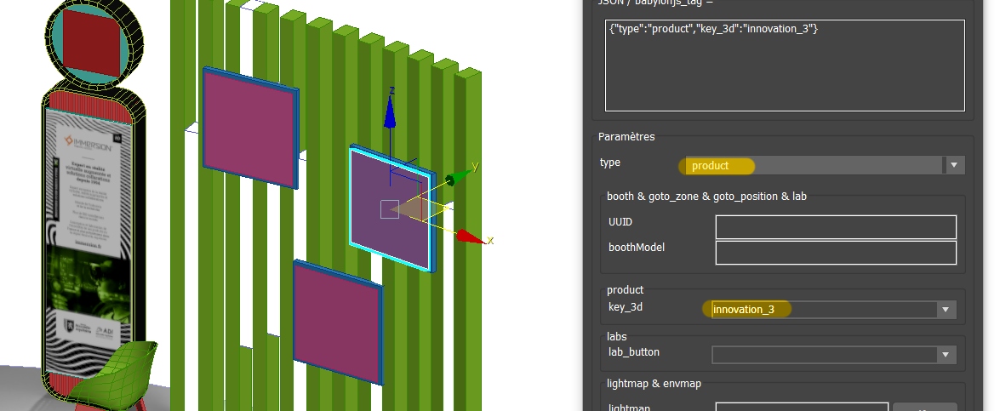

# Congress : Propriétés des objets 3D

Toutes les propriétés réglées via l'outil maxscript sont stockées dans chaque objet en JSON. Cela permet à l'appli web de les trier et de les traiter différemment (clic, orientation, matériaux, etc.)

<style>img {float:right;margin:1rem;}
h1, h2, h3, h4, h5, h6 { clear:both;}
</style>

## 1. Types d'objets


- [billboard](#billboard)
- [booth](#booth)
- [booth_camera](#booth_camera)
- [booth_model](#booth_model)
- [booth_silhouette](#booth_silhouette)
- [camera](#camera)
- [camera_position](#camera_position)
- [conference](#conference)
- [envmap](#envmap)
- [goto_booth](#goto_booth)
- [goto_position](#goto_position)
- [goto_zone](#goto_zone)
- [ground](#ground)
- [lab](#lab)
- [lightmap](#lightmap)
- [product](#product)
- [product_standalone](#product_standalone)
- [autres](#autres)

<span class="space"/>


### billboard
A utiliser avec une plane qui sera orientée en permanence vers la caméra. Ex: les panneaux au dessus du démonstrateur.

<span style="color:darkorange;">Le pivot de l'objet doit être centré et orienté avec l'axe Y rentrant dans l'objet.</span>

<span class="space"/>


### booth

L'objet sera traité comme un Booth par l'appli web, il sera cliquable (si l'uuid existe) et les éléments qui le composent seront eux aussi traités de manière particulière.

Il est nécessaire de remplir le champ `UUID` pour pouvoir interagir avec le stand durant la visite. Cette donnée est à récupérer depuis la base de donnée.

Si le champ `boothModel` est spécifié, cet objet sera remplacé au runtime par l'objet 3d de type [booth_model](#booth_model) dont le champ `boothModel` est identique.

**Voir [2. Mise en place d'un stand](#2-mise-en-place-dun-stand) pour plus d'informations.**

<span class="space"/>


### booth_camera

Point de vue lors de l'entrée sur un stand.

Une ou plusieurs caméras peuvent être définies pour un stand. En cas de points de vue multiples, des sprites permettant de passer de l'une à l'autre seront affichées.

Ces caméras doivent être parentées à un objet de type [booth](#booth) ou [booth_model](#booth_model). **Voir [2. Mise en place d'un stand](#2-mise-en-place-dun-stand) pour plus d'informations.**

<span style="color:darkorange;">Si aucune caméra n'est définie pour un stand, il sera impossible d'y accéder.</span>

<span class="space"/>


### booth_model

L'objet sera cloné/instancié sur les objets du type [booth](#booth) selon la correspondance des champs `boothModel`.

Il y aura normalement une lightmap bakée pour ce stand, donc il est intéressant de l'indiquer dans le champ `useLightmap` de cet objet.

Afin d'afficher le tooltip Kinoba d'information sur le stand, on peut cocher la case `booth_tooltip` dans *divers* en bas.

**Voir [2. Mise en place d'un stand](#2-mise-en-place-dun-stand) pour plus d'informations.**

<span class="space"/>


### booth_silhouette

Cet objet sera remplacé au runtime par un billboard représentant une silhouette (si un exposant est disponible). On utilisera un objet Point/Dummy positionné au niveau du sol et aux emplacements où l'on souhaite voir apparaître une silhouette. Il peut y en avoir plusieurs par stand.

<span class="space"/>


### camera

C'est la caméra utilisée comme point de vue de départ lors de l'arrivée dans une Zone.

Pour être 

<span style="color:red;">**Elle est unique, et INDISPENSABLE au bon chargement de la Zone !**</span>

<span class="space"/>


### camera_position
Permet de définir une position caméra prédéfinie qui sera accessible lors du clic sur un objet du type [goto_position](#goto_position).

S'applique sur une caméra positionnée dans la Zone.

**Fonctionne en relation avec les objets du type [goto_position](#goto_position).**

<span class="space"/>


### conference

Un clic sur cet objet, redirige vers l'URL de la conférence en cours, ou vers la liste des conférences si aucune n'est en live.

L'`UUID` est nécessaire pour savoir sur quel "plateau" se situe la conférence. *Avec l'implementation actuelle, il est nécessaire de modifier également le code pour que ça fonctionne...*

Ce composant est dépendant de `front/src/router/modules/conferences.jsx` géré par Kinoba.

<span class="space"/>


### goto_booth
Le clic sur cet objet aura la même action que "Accéder au stand" depuis le tooltip, ou depuis la page du stand (hors 3D). La caméra va se diriger vers le stand et on pourra interagir avec les produits etc.

Il est nécessaire de renseigner le champ `UUID` avec l'uuid du stand en question.

C'est ce qui est utilisé pour accéder aux stands depuis les signalétiques en entrée de Zone par exemple.

<span class="space"/>


### goto_position
Permet de se déplacer vers une position caméra prédéfinie lors du clic sur cet objet.

**Utilisé en relation avec [camera_position](#camera_position).**

<span class="space"/>


### goto_zone
Permet de charger une Zone différente lors du clic sur cet objet.

Il est nécessaire de renseigner le champ `UUID` avec l'uuid de la Zone en question.

<span class="space"/>


### ground

Lors du clic sur un objet de ce type, la caméra se déplace à la position cliquée à une hauteur de 150 cm. De plus sur desktop un sprite s'affiche à la position du curseur.

Afin de mieux gérer les zones où il est possible de se déplacer, il est préférable d'appliquer ce type à un objet invisible (le matériau "invisible" est chargé au runtime depuis matLib.glb), se trouvant à peine au dessus (0.5 ou 1 cm) du sol visible. Comme on peut le voir sur l'image ci-dessus entourée en jaune.

<span class="space"/>


### lab

Un Lab est un composant particulier de NOVAQ. Il est composé d'un parent ayant le type [lab](#lab) (ici le contour avec le wirecolor vert) avec le champ `UUID` rempli. Et d'enfants qui serviront à ouvrir les overlays affichant les informations, images et vidéos ayant le champ `lab_button` réglé sur `infos`, `image` ou `video` (ici avec les wirecolors orange, rouge et bleu).

<span style="color:darkorange;">Le pivot de l'objet parent doit être centré et orienté avec l'axe Y rentrant dans l'objet (comme le gizmo qu'on voit sur le lab du haut).</span>

Dans la hiérarchie on peut voir un objet à l'intérieur des boutons. Comme les pictogrammes sur les boutons sont creux, ça permet d'empêcher de cliquer au travers, ils ont un matériau totalement transparent mais qui va capter les clics. Leur champ `lab_button` est défini de manière identique au bouton afin d'avoir la même action.

L'objet `lab_a_support_images` (avec le wirecolor blanc), a un matériau statique directement appliqué dans l'éditeur 3d...

Le contenu devant être mis à jour durant le salon, les informations (liens vers images, vidéo) doit être contenu dans un fichier facilement modifiable (`public/assets/webgl/labs/labs-live-data.json`) au format suivant :
```json
[
  {
    "labUuid": "5f759e8a99c5ea0019dc35d6",
    "labName": "Mobilité du futur",
    "imageUri": "",
    "videoUri": ""
  },
  {
    "labUuid": "5f74836950e0fc0024d442c9",
    "labName": "Comment moi, PME de la filière cosmétique, je peux être impliquée dans la RSE ?",
    "imageUri": "",
    "videoUri": "https://youtu.be/n3lg3H5RRN8"
  },
  //...
]
  ```

<span class="space"/>


### lightmap

Permet de définir cet objet (et plus particulièrement 2 maps de son matériau) comme support d'une lightmap (Base Color Map) et d'une aomap (Diffuse Roughness Map).

Le nom donné dans le champ `lightmap` sera le nom à indiquer dans le champ `useLightmap` des objets utilisant cette lightmap.

Dans l'image ci-dessus on voit à gauche les propriétés et le matériau de l'objet porteur de la lightmap, et à droite les propriétés du sol du stand. *On notera qu'ici il n'y a pas de dummy comme parent, tous les objets du stand sont parentés au sol, ça fonctionne de la même manière.* Le couple lightmap/aomap sera appliqué à l'objet sol ainsi que tous les objets parentés à lui.

- <span class="color-box" style="background-color: #ffd200"/> En jaune le type [lightmap](#lightmap) et le nom de cette lightmap
- <span class="color-box" style="background-color: #00a8ff"/> En bleu le même nom reporté dans les propriétés de l'objet utilisant cette lightmap

```note
Etant donné que le couple lightmap/aomap est appliqué à toute l'arborescence d'objets à partir du parent sur lequel est déclaré `useLightmap`, il est possible d'empêcher son application en indiquant `none` dans `useLightmap` sur un objet enfant précis. C'est utilisé sur les objets en verre, tels que la vitre sur le support PDF, et le pied en verre du calendrier.
```

<span class="space"/>


### product

L'objet de ce type sera utilisé pour afficher les médias fournis par l'API Kinoba. Les objets de type [product](#product) doivent également spécifier le champ `key_3d` afin de savoir quels médias afficher sur tel ou tel objet.

Les valeurs de `key_3d` sont susceptibles d'évoluer :
- company_logo : le logo affiché dans les cercles sur les totems ou sur l'enseigne haute
- company_totem : l'affiche du totem (au format vertical pour novaq et estp)
- company_pdf_1 : page du porte documents (le document pdf qui sera affiché dans un viewer côté Kinoba)
- company_video_1 : écran TV
- innovation_1 :
- innovation_2 :
- innovation_3 : la présentation des produits de la société

```note
Les produits `innovation_N` sont particulier dans le sens où ils peuvent être composés de multiples médias, plusieurs images, pdf et vidéos. Dans ce cas des flèches sont ajoutées au runtime pour switcher de l'un à l'autre.
```

<span style="color:darkorange;">Le pivot de l'objet doit être centré et orienté avec l'axe Y rentrant dans l'objet.</span>

<span class="space"/>


### product_standalone
Il s'agit d'un produit qui n'est pas rattaché à un stand particulier. L'objet sera cliquable (lors du déplacement dans les allées) et la caméra se déplacera en face de celui-ci, mais aucun bouton retour ne sera affiché, il faudra tourner manuellement la vue et cliquer sur le sol pour s'en éloigner.

Le média affiché sera celui du matériau appliqué dans l'éditeur 3d...

<span style="color:darkorange;">Le pivot de l'objet doit être centré et orienté avec l'axe Y rentrant dans l'objet.</span>

<span class="space"/>


### autres
- envmap
- elevator
- elevator_camera
- product_animated


## 2. Mise en place d'un stand

### 2.1 Fonctionnement
En général, la mise en place d'un stand se déroule en deux temps. On crée un *modèle de stand* auquel sont parentés tous les éléments de ce stand (meshes, caméras, etc.). Ensuite on positionne les stands sous forme de Points aux positions réelles où doivent se trouver les stands dans la zone. Au runtime les points seront remplacés par les modèles. Cela permet de réduire la taille du fichier 3d exporté, l'instanciation est réalisée par l'appli web.

Pour les stands particuliers (stands premium personnalisés) il n'est pas nécessaire d'utiliser de "modèle de stand" puisqu'ils seront uniques.

```note
L'utilisation des [booth_model](#booth_model) n'est pas du tout obligatoire.

Mais lorsqu'il y a beaucoup de stands identiques, en plus de réduire le poids des fichiers exportés, cela permet de n'effectuer qu'une seule fois les modifications, le baking et les réglages des objets enfants.
```
Pour illustrer les 2 cas de figure :

#### 2.1.1 Sans modèle


Dans le cas où on n'utilise **pas** de modèle, le parent (Point) est directement défini comme [booth](#booth) et son `UUID` est spécifié. `useLightmap` contient le nom de la lightmap à appliquer sur les objets enfants, et `booth_tooltip` est coché tout en bas, ce qui permettra d'afficher le tooltip Kinoba avec la description et le bouton pour "accéder" au stand.

#### 2.1.2 Avec modèle


Dans le cas où on utilise un modèle de stand, on trouve à gauche les propriétés du modèle (type [booth_model](#booth_model)), et à droite les propriétés du stand (type [booth](#booth)) sur lequel on va instancier le modèle. On voit tout de suite (en vert) que la propriété `boothModel` est identique.

En ce qui concerne le **modèle** :
- <span class="color-box" style="background-color: #0055c8"/> Type [booth_model](#booth_model)
- <span class="color-box" style="background-color: #00881a"/> Nom du modèle dans `boothModel`
- On ne spécifie **pas** d'`UUID` puisque ce modèle sera instancié sur plusieurs **stands** qui auront des `UUID` différents.
- <span class="color-box" style="background-color: #570288"/> Si une [lightmap](#lightmap) a été baké pour ce stand indiquer son nom dans le champ `useLightmap` (une liste déroulante indique les noms des lightmaps présentes dans la scène max)
- <span class="color-box" style="background-color: #570288"/> On coche `booth_tooltip` afin d'ouvrir le tooltip Kinoba. On aurait pu le cocher au niveau du stand lui même, mais il faudrait alors le cocher pous tous les stands, c'est plus simple ici)

Et pour le **stand** :
- <span class="color-box" style="background-color: #c87a00"/> Type [booth](#booth)
- <span class="color-box" style="background-color: #c87a00"/> UUID du stand
- <span class="color-box" style="background-color: #00881a"/> Nom du modèle dans `boothModel`

### 2.2 Hiérarchie du stand


Le stand est défini par son objet parent ayant le type **[booth](#booth)**.
```note
En cas d'utilisation d'un modèle de stand, au runtime l'objet [booth_model](#booth_model) est cloné en tant qu'enfant du dummy [booth](#booth) donc cela revient exactement au même, il y a juste un niveau de parentée supplémentaire.
```

Tous les objets faisant partie du stand doivent y être parentés : produits, caméras, contact, silhouettes, etc. Peu importe si ce sont des enfants direct ou non, ils peuvent très bien être parentés à des objets intermédiaires tant que ceux-ci sont eux-mêmes parentés à l'objet [booth](#booth).

Détail de l'arborescence ci-contre :
- <span class="color-box" style="background-color: #ffd200"/> L'objet parent [booth](#booth)
- <span class="color-box" style="background-color: #ffd200"/> 
- <span class="color-box" style="background-color: #ffd200"/>
- <span class="color-box" style="background-color: #ffd200"/>
- <span class="color-box" style="background-color: #ffd200"/>
- <span class="color-box" style="background-color: #ffd200"/>
- <span class="color-box" style="background-color: #ffd200"/>


